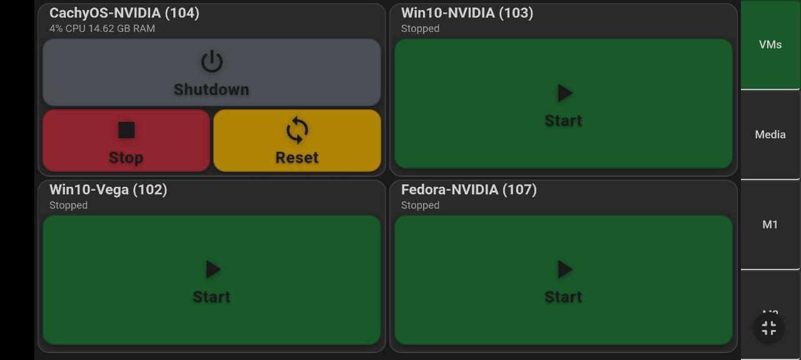
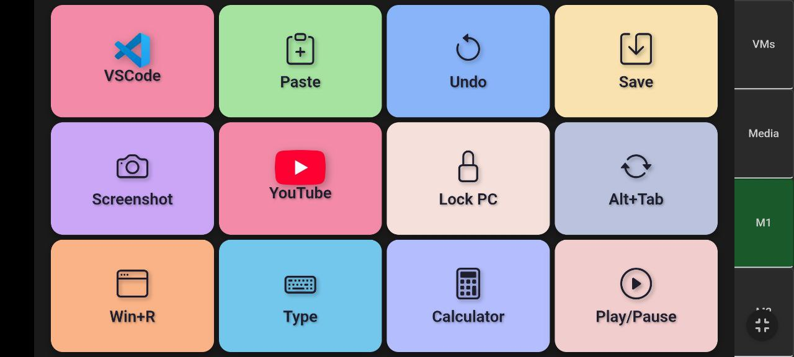
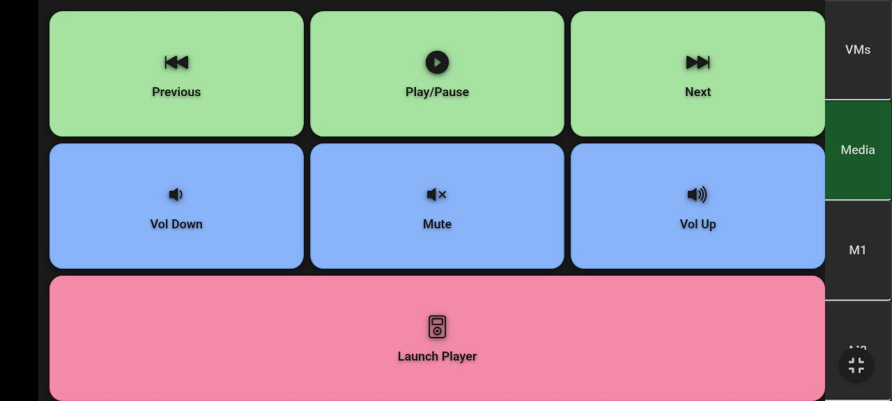

# ProxPad - Proxmox VM Management Stream Deck/Macropad
ProxPad is a web-based Stream Deck/Macropad for managing Proxmox virtual machines and controlling macros/media actions, designed for mobile-first usability and seamless resource conflict management. It can also operate independently of Proxmox for general macro/media control.

- **Server Component (`proxpad.py`)**: Runs on your Proxmox server or in an LXC container, providing the web interface and VM management features.
- **Client Component (`macro_handler.py`)**: A lightweight, cross-platform Python script for Linux or Windows VMs, enabling macro execution and media control with minimal dependencies.

All configuration is centralized in `config.py` on the server, making setup and customization straightforward.

## Screenshots

**Portrait Mode (Mobile)**

---

---

---
## Features
- **Mobile-Optimized Interface**: Responsive, touch-first grid and layouts for phones and tablets.
- **Haptic feedback**: Tactile vibration cues on compatible devices.
- **Resource Conflict Management**: SAME_RESOURCES groups hide/show VMs that share hardware when one is running.
- **Live VM State & Auto-refresh**: Real-time VM status with UI updates on state/visibility changes.
- **Quick Actions**: One-tap Start, Stop, Reboot, Shutdown and Restart (via Proxmox API).
- **Confirmation Dialogs (SHY)**: Optional modal confirmations before VM actions.
- **Macro Pages**: Configurable macro button pages to send key combos, run commands, or launch apps or urls.
- **Support for GIF icons**: Button icons can show animated icons.
- **Media Tab**: Media page for embedded player launch and control.
- **Macro Handler (Client)**: Lightweight `macro_handler.py` for Windows/Linux. On Linux it can use `uinput` for a virtual keyboard (reliable media/special keys). Minimal deps (`pynput`, optional `python-uinput`). Run as a background service or autorun.
- **Proxmox API Token & Permissions**: Use a Proxmox API token for access (disable Privilege Separation).
- **Install / Update Helpers**: Provided install scripts (deps, uinput) and run_me.sh for background/startup use.

## Prerequisites
- Proxmox VE server (macropad can work without it)
- Python 3.6+
- Flask
- proxmoxer
- pyinput
- uinput on Linux

## Installation

1. **Clone the project:**
   ```sh
   git clone https://github.com/Yury-MonZon/ProxPad.git
   cd ProxPad
   ```

2. **Install dependencies for Server part - `proxpad.py`(run on Proxmox server or in LXC):**
   - On Arch/CachyOS: `./install_debs_cachyos.sh`
   - On Debian/Ubuntu: `./install_deps_debian.sh`

   **Install dependencies for Client part - `macro_handler.py`(run inside VM's):**
   - On Windows/Linux: `pip install pynput`

3. **Configure Proxmox API Token:**
   - Log into Proxmox web interface
   - Go to **Datacenter → Permissions → API Tokens**
   - Create a new token (e.g., user: `root@pam`, token ID: `ProxPad`)
   - **Disable "Privilege Separation" for the token**

4. **Configure ProxPad:**
   - Edit `config.py`.
   ```python
   PROXMOX_HOST = "your.proxmox.server.ip"
   PROXMOX_TOKEN_ID = "ProxPad"
   PROXMOX_TOKEN_SECRET = "your-token-secret"
   VM_IDS = [101, 102, 103, 104]
   SAME_RESOURCES = [ [101, 102], [103, 104] ]
   ```

## Linux Keyboard Emulation: Why Use uinput?

On Linux, ProxPad uses the kernel's uinput to create a virtual keyboard that the system treats like a real one, so media keys and special combos (like Super/Win shortcuts) work reliably without permission pop‑ups — just run the included install script in the VM and reboot to enable it.  

**Why uinput?**
- Works reliably for all key combos, including Super/Win keys
- No need for user confirmation dialogs every time
- Avoids sandbox and security limitations of portals
- Can be set up for non-root usage with proper permissions

**How to install and set up uinput:**
1. Run the provided install script **inside your Linux VM(not needed for Windows VM)**:
   ```sh
   ./install_uinput.sh
   ```
   This will:
   - Load the uinput kernel module at boot
   - Set correct group and permissions for `/dev/uinput`
   - Add your user to the `input` group

2. Reboot for group changes to take effect.

After setup, `macro_handler.py` will use uinput for keyboard emulation on Linux, allowing secure, reliable macro execution without root or portal limitations.

For more details, see the comments in `install_uinput.sh`.

## Supported macro commands
   - `key:win+l` or `key:f` press the key or key combo
   - `exe:calc` or `exe:c:\totalcmd\totalcmd.exe` execute specified binary  
   - `url:https://google.com` open url in default browser
   - `type:some text here` type the specified text, '\' has to be input as '\\'

## Running ProxPad

1. **Start the server:**
   ```sh
   python proxpad.py
   ```
2. **Access the interface:**
   - Open your browser to `http://your-server-ip:5000`
   - For mobile, bookmark or "Add to Home Screen"
3. **Background operation:**
   ```sh
   ./run_me.sh &
   ```

## Usage

### Desktop/Tablet
- Responsive grid for VMs
- Landscape: more VMs horizontally
- Portrait: VMs stacked vertically

### Mobile Phones
- You can use OperaMini or Kiosk mode to show the ProxPad in fullscreen mode on Android
- Optimized button layouts for touch
- Thumb-friendly sizing

### VM Controls
- **Start**: start VM
- **Reboot**: Graceful restart, can be hidden via config
- **Shutdown**: Graceful shutdown
- **Stop/Reset**: stop VM
- **Reset**: reset VM

### Resource Management
- When VM starts → other VMs with the same resources hide
- When VM stops → other VMs with the same resources reappear
- Page auto-refreshes on VM state change

## Macro Handler: Running macro_handler.py in VMs

To process media keys, macro buttons, and program execution, you must run `macro_handler.py` inside each Windows or Linux VM you want to control. This script listens for UDP broadcast commands from `proxpad.py` and executes the requested actions locally in the VM.

- On Windows: Run `python macro_handler.py` (requires Python and pynput)
- On Linux: Run `python macro_handler.py` (requires Python and uinput for full key support)

**Note:**
- The macro handler must be running in the background in each VM for ProxPad's media and macro buttons to work. Not needed for VM control.
- On Linux, ensure uinput is set up for full key emulation.
- You can set up the macro handler to start automatically on VM boot for seamless integration.

## Troubleshooting

### Connection Issues
- Check Proxmox API token (disable Privilege Separation)
- Token needs `VM.Audit` and `VM.PowerMgmt` permissions
- Ensure network connectivity
- Set `VERIFY_SSL = False` for self-signed certs

### VM Not Appearing
- Check `VM_IDS` in config
- Check token permissions
- VM may be hidden due to `SAME_RESOURCES`

### Page Not Updating
- Ensure server is running
- Check browser cache
- Reload page

## License (GPL v3)

This project is licensed under the GNU General Public License version 3 (GPL‑3.0). You are free to copy, modify, and redistribute this software under the terms of the GPL v3.

See the full license in the included LICENSE file or at https://www.gnu.org/licenses/gpl-3.0.en.html

## Contributing

Feel free to submit issues, feature requests, or pull requests to improve ProxPad.

## Help! I can't set it up

### Paid Support

Paid, one‑on‑one support is available for installation, configuration, custom macros, uinput setup, and troubleshooting.

Contact me via discord: `monzon4765`

## Support the project
[](https://ko-fi.com/yurymonzon)

If you found this project useful, consider supporting my work with a small donation: https://ko-fi.com/yurymonzon Your support is greatly appreciated!


